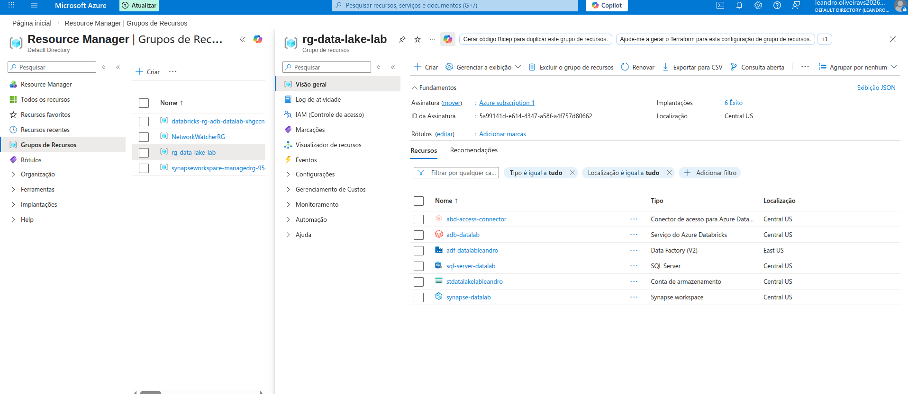
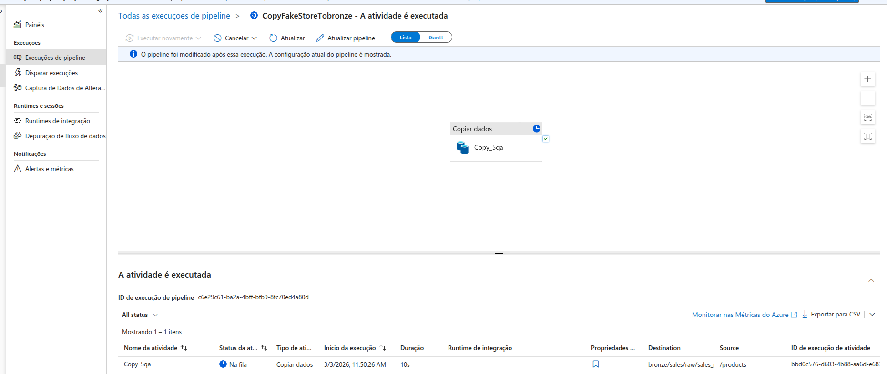
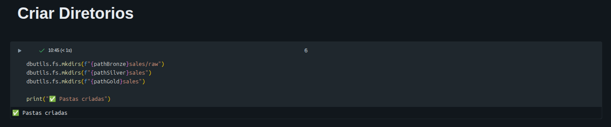
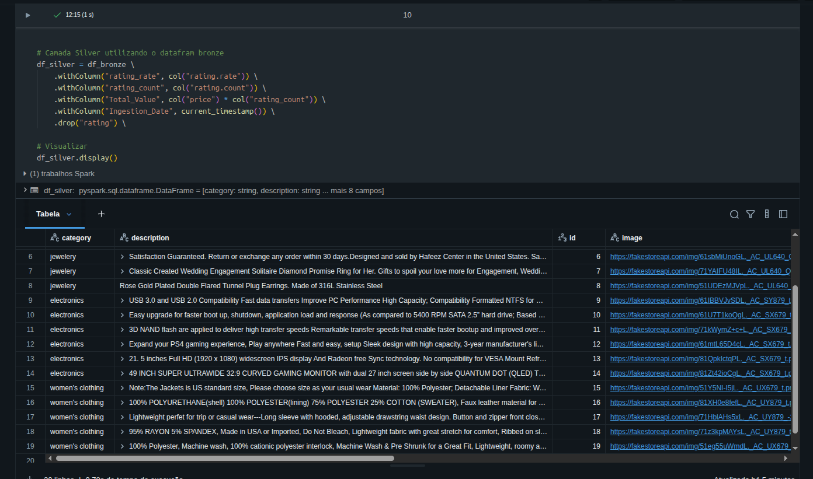
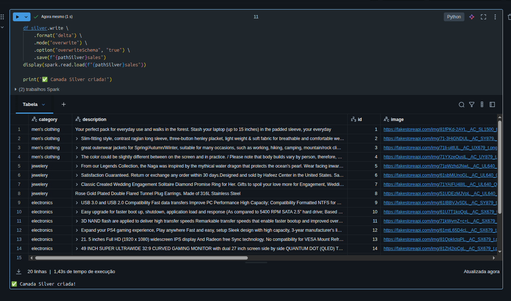
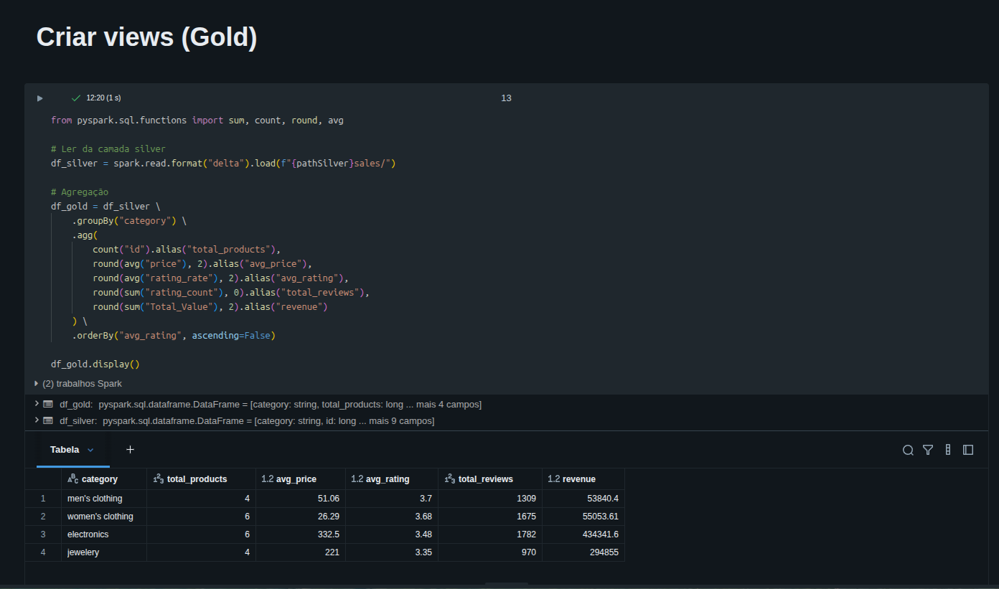
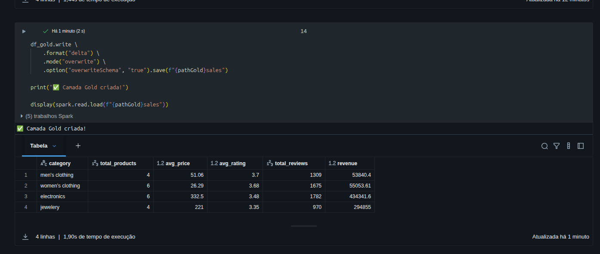
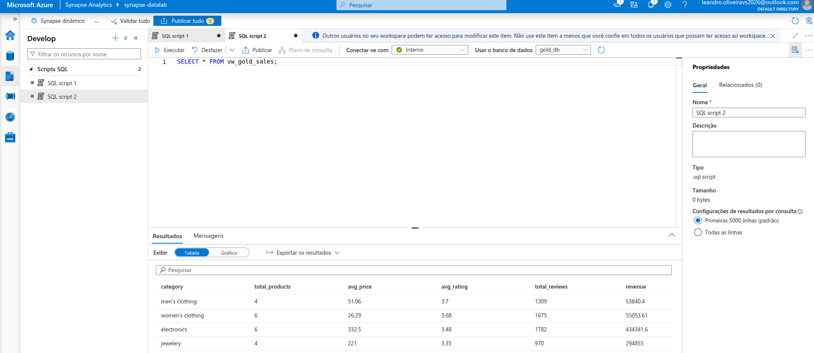

# 🏗️ Pipeline de Vendas — Lakehouse com Arquitetura Medallion no Azure


## 📌 Visão Geral
Pipeline completo de engenharia de dados implementando a **Arquitetura Medallion** 
(Bronze → Silver → Gold) na plataforma Azure, com consumo via Power BI.

## 🏛️ Arquitetura
```
Fake Store API
      │
      ▼
Azure Data Factory ──► Bronze (JSON)
                            │
                            ▼
                     Silver (Delta Lake)
                     limpeza + colunas derivadas
                            │
                            ▼
                      Gold (Delta Lake)
                      agregação por categoria
                            │
                            ▼
                   Azure Synapse Analytics
                   (Serverless SQL + View)
                            │
                            ▼
                       Power BI Web
                        Dashboard
```

## 🛠️ Stack Tecnológica
| Tecnologia | Função |
|---|---|
| Azure Data Lake Gen2 | Armazenamento centralizado |
| Azure Data Factory | Ingestão via API HTTP |
| Azure Databricks | Processamento PySpark |
| Delta Lake | Formato transacional |
| Azure Synapse Analytics | Camada SQL Serverless |
| Power BI Web | Visualização e Dashboard |

## 📂 Estrutura
```
notebooks/
├── 01_config.py           # Configuração Data Lake
├── 02_bronze_ingestion.py # Validação ingestão ADF
├── 03_silver_transform.py # Limpeza e transformação
└── 04_gold_aggregation.py # Métricas de negócio
```

## 📊 Resultado — Camada Gold
| category | total_products | avg_price | avg_rating | total_reviews |
|---|---|---|---|---|
| electronics | 6 | 332,5 | 3,48 | 1782 |
| jewelery | 4 | 221 | 3,35 | 970 |
| men's clothing | 4 | 51,06 | 3,7 | 1309 |
| women's clothing | 6 | 59,63 | 3,63 | 1590 |

## ✅ Competências Praticadas
- [x] Arquitetura Medallion (Bronze/Silver/Gold)
- [x] Azure Data Lake Gen2
- [x] Azure Data Factory — ingestão via API HTTP
- [x] PySpark — transformação distribuída
- [x] Delta Lake — formato transacional
- [x] Azure Synapse Analytics Serverless SQL
- [x] Power BI Web — dashboard de negócio

## 💰 Custo Estimado
Projeto desenvolvido com foco em economia:
- Cluster Databricks: Single Node + auto-terminate 15min
- Synapse: Serverless (paga por query)
- Custo total estimado: **< $30**

## 📸 Documentação do Processo

### ☁️ Resource Group — Recursos Azure


### 🗄️ Storage Account — Data Lake Gen2


### 🔶 Pipeline de Ingestão — Azure Data Factory


### 📁 Estrutura de Diretórios


### ⚙️ Camada Silver — Transformação PySpark



### 🏆 Camada Gold — Agregação



### 🔍 Azure Synapse Analytics


### 📊 Power BI
